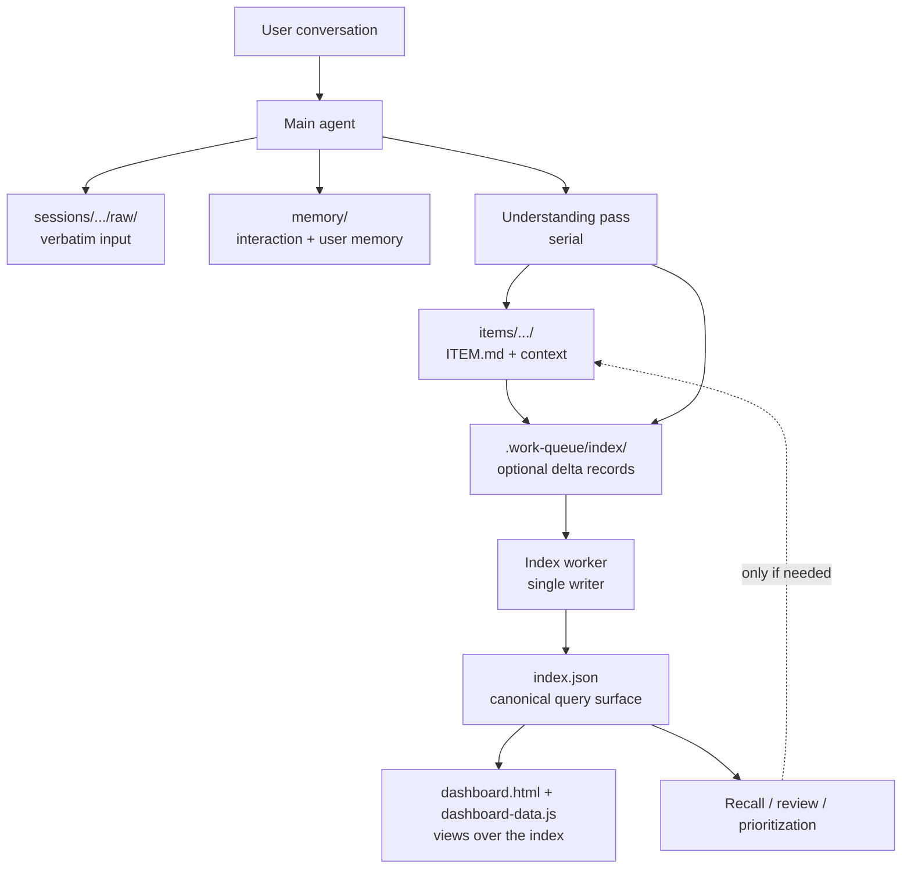
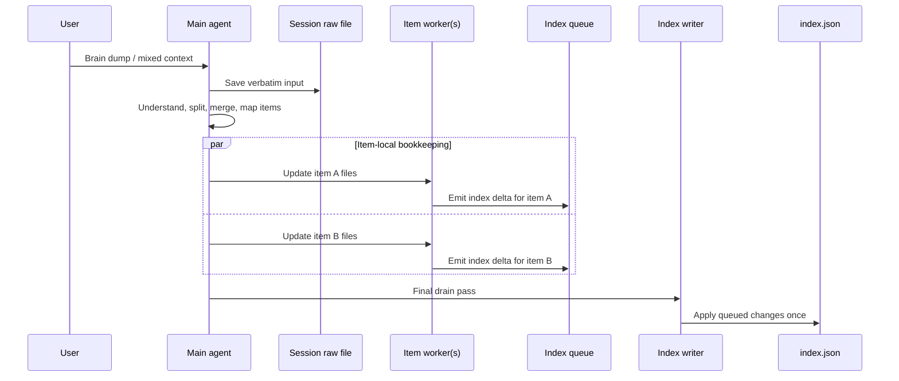
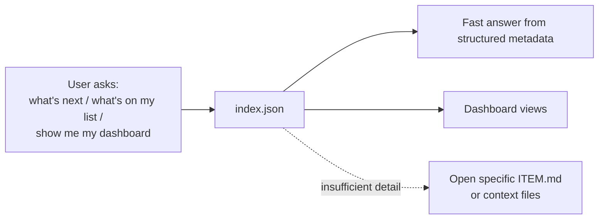

# unstuck

A thinking partner skill for agentic coding tools. Get what's in your head out, organized, and visible.

## Installation

```bash
npx skills add bladnman/unstuck
```

## What it does

You talk. It listens, captures, and organizes.

Unstuck is a conversational skill that helps you externalize everything swimming in your head — tasks, ideas, anxieties, half-formed plans, competing priorities — and turns it into a structured, searchable, persistent system of markdown files. It's not a to-do app, not a planner, not an ideation tool. It's a **thinking partner** that catches what you say and gives it back to you organized.

Everything lives in one central folder (`~/.unstuck/` by default), accessible from any project directory. Items accumulate context over time. Sessions are logged. Memory compounds — the skill learns how you think and what you care about, so every conversation starts warm.

## Quick usage

**Brain dump:**
```
/unstuck I'm overwhelmed, let me get everything out
```
Start talking. The skill captures everything, identifies distinct items, creates organized folders, and reflects patterns back to you.

**Check in:**
```
/unstuck what should I work on today?
```
Gets a recommendation based on your active items, deadlines, and energy patterns.

**Recall:**
```
/unstuck what was that API thing we talked about?
```
Finds and surfaces your captured notes on a topic.

**Review:**
```
/unstuck what's on my list?
```
Shows the current state of everything you're tracking — active, simmering, parked.

**Dashboard:**
```
/unstuck show me my dashboard
```
Opens an interactive HTML dashboard with table, kanban, and timeline views.

## How it works

```
~/.unstuck/                          # Default location (relocatable)
├── index.json                  # Canonical structured index for the whole system
├── memory/                     # Who you are and how you like to work
│   ├── MEMORY.md
│   └── *.md
├── items/                      # One folder per topic/idea/task
│   └── api-redesign-idea/
│       ├── ITEM.md             # The definitive, evolving readout
│       └── context/            # Supporting material and session extracts
├── sessions/                   # Chronological session logs
│   └── 2026-03-12/
│       ├── SESSION.md
│       └── raw/                # Verbatim inputs preserved
├── .work-queue/                # Optional ephemeral coordination queues
│   ├── index/                  # Single-writer index deltas land here first
│   └── ingest/                 # Optional ingest manifests and work packets
├── dashboard.html              # Persistent local dashboard shell
└── dashboard-data.js           # Optional browser companion derived from index.json for file:// use
```

**Items are folders, not files.** Each topic accumulates context over time — new sessions add to it, but the ITEM.md stays coherent. Context files preserve your exact words. Nothing gets overwritten or lost.

**The structured index is the primary data structure.** Agents should read `index.json` first for recall, review, prioritization, and filtering. It's optimized for fast system-wide lookup, not for human browsing.

**The dashboard is exhaust.** `dashboard.html` is just a view over the index. If you want to open it directly from the filesystem, `dashboard-data.js` can mirror `index.json` for browser compatibility, but `index.json` remains the source of truth for the whole system.

**Hard rule:** if `index.json` changes, `dashboard-data.js` is stale until it is regenerated. Do not treat the dashboard as current after any index mutation until the browser companion has been refreshed.

Regenerate it mechanically:

```bash
node scripts/refresh_dashboard_from_index.mjs /absolute/path/to/unstuck
```

**Planning data should be optimistic, not precious.** If an item has no real schedule yet, the index should still carry a rough `plannedStart` and `durationDays` for the next meaningful push so the timeline stays useful. Those dates are working assumptions, not commitments. When timing is fuzzy, synthesize a coarse working window from the item's due date, state, and scope instead of leaving the plan blank. If weekend availability matters, add `scheduleMode: "weekdays"` or `scheduleMode: "all-days"` so the timeline can render the block correctly.

**Optional day-planning detail can sit alongside those coarse fields.** When the system has a real same-day block in mind, it can also store `fixedStartTime` (`HH:MM`) and `durationMinutes` so a calendar-style day view can place the item on an hour grid without changing the canonical day-level contract.

**Ingest is staged.** Understanding the user's dump is serial. Once the item map is clear, item-local bookkeeping should fan out. If the host supports subagents and there are 2 or more item packets, the default shape is one subagent per item packet, ideally in parallel, while `index.json` stays single-writer. If the host cannot do that cleanly, it should say so and fall back to inline bookkeeping.

**Memory makes it compound.** The skill maintains its own persistent memory about who you are, how you like to interact, what corrections you've given, and the shape of your priorities. This is what makes session 50 feel different from session 1.

## Data location

By default, data lives at `~/.unstuck/`. If you want it somewhere else — like a synced folder for multi-machine access — just tell the skill:

```
/unstuck change location
```

It will move your data to the new path and leave a pointer file at `~/.unstuck/relocated.md` so every future session finds it automatically. Multiple agent tools on multiple machines can all share the same data this way.

You can also set the `UNSTUCK_HOME` environment variable to override everything.

## Designed for agentic coding tools

This skill works with any agent that can read/write files and hold a conversation:

- **Cursor** — add to `~/.cursor/skills/`
- **Claude Code** — add to `~/.claude/skills/`
- **Codex** — add to `~/.codex/skills/`
- **Gemini** — add to `~/.gemini/skills/`
- **Anything else** — as long as it can read the SKILL.md and follow instructions, it works

No APIs, no dependencies, no build step. It's markdown files and a conversation protocol.

## Workflow diagrams

These diagrams show the core concept: understand first, then organize; keep the index machine-readable and single-writer; let the dashboard and recall flows read from that index first.

### Core architecture



### Ingest flow



### Read path



### Queue helpers

When you want to use the staged ingest model mechanically instead of just conceptually:

```bash
node scripts/create_ingest_run.mjs /absolute/path/to/unstuck <<'JSON'
{
  "summary": "Mixed ingest after serial understanding",
  "session": {
    "id": "2026-03-13_04",
    "path": "sessions/2026-03-13_04/SESSION.md",
    "rawInputs": ["sessions/2026-03-13_04/raw/input-01_brain-dump.md"]
  },
  "items": [
    {
      "itemId": "all-hands-slides",
      "action": "update",
      "workerBrief": "Update the item, write context, then queue the index delta."
    }
  ]
}
JSON

node scripts/queue_index_update.mjs /absolute/path/to/unstuck <<'JSON'
{
  "itemId": "all-hands-slides",
  "patch": {
    "status": "Urgent",
    "lastTouched": "2026-03-13",
    "plannedStart": "2026-03-13",
    "durationDays": 4
  },
  "source": {
    "session": "2026-03-13",
    "worker": "item-all-hands"
  }
}
JSON

node scripts/update_ingest_packet.mjs /absolute/path/to/unstuck \
  .work-queue/ingest/runs/RUN_ID/packets/01-all-hands-slides.json <<'JSON'
{
  "status": "done",
  "worker": "item-all-hands",
  "summary": "Updated item files and queued the index delta",
  "queuedIndexUpdate": true
}
JSON

node scripts/finalize_ingest_run.mjs /absolute/path/to/unstuck RUN_ID
```

`create_ingest_run.mjs` writes a run manifest and one packet file per item under `.work-queue/ingest/`. In a capable host, those packets are meant to be handed to item-local subagents rather than processed inline. Workers update packet status with `update_ingest_packet.mjs`. `queue_index_update.mjs` writes structured delta files into `.work-queue/index/`. `finalize_ingest_run.mjs` closes the ingest run and drains the single-writer index queue. `drain_index_queue.mjs` is still available when you only need the index drain step by itself, outside the full ingest-run flow.

## License

MIT
